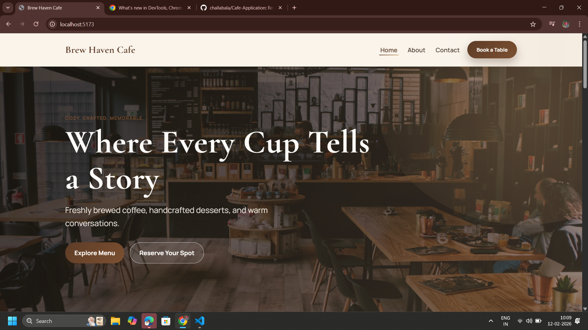
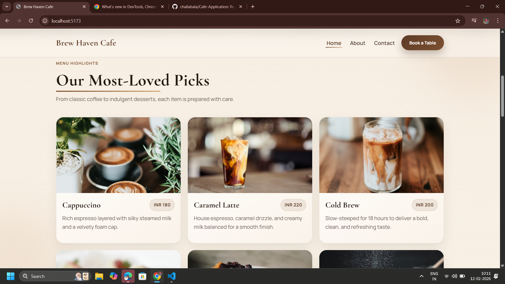
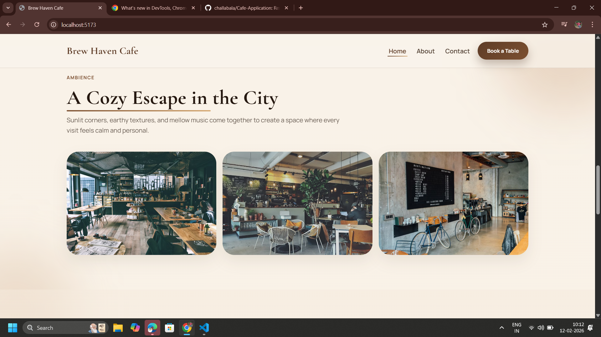
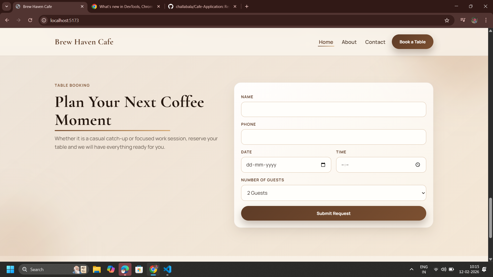

# Brew Haven Cafe

A modern, responsive cafe website built with React and Vite.

This project showcases clean component architecture, route-based navigation, interactive forms, and polished UI storytelling for a real-world brand-style experience.

## Recruiter Snapshot

- Built with `React 18`, `Vite`, and `React Router`
- Multi-page app flow: `Home`, `About`, and `Contact`
- Reusable component-driven UI (`Navbar`, `Footer`, cards, reveal animation wrapper)
- Interactive booking and contact forms with client-side validation patterns
- Responsive layout with mobile menu, grid transitions, and smooth scrolling
- Attention to detail in UX: section reveals, animated hero, and visual hierarchy

## Visual Preview

### Hero / Brand Feel



### Menu Showcase



### Cafe Ambience



### Team / Story Tone



### Add Your Screenshots

Put your images in `src/assets/` using these exact names:

- `hero.png`
- `menu.png`
- `ambience.png`
- `team.png`

## Tech Stack

- `React 18`
- `React Router DOM 6`
- `Vite 5`
- Plain CSS (custom design system and responsive breakpoints)

## Key Features

- Route-based page experience with persistent navigation and footer
- Hash-based smooth scrolling to targeted sections (`#menu`, `#booking`)
- Booking form with date/time selection and success state
- Contact form with controlled components and confirmation state
- Scroll-triggered reveal animations using `IntersectionObserver`
- Fully responsive behavior across mobile, tablet, and desktop

## Project Structure

```txt
src/
  assets/
    content.js
  components/
    Footer.jsx
    MenuCard.jsx
    Navbar.jsx
    Reveal.jsx
    TeamCard.jsx
    TestimonialCard.jsx
  pages/
    AboutPage.jsx
    ContactPage.jsx
    LandingPage.jsx
  styles/
    global.css
  App.jsx
  main.jsx
```

## Getting Started

### 1. Install dependencies

```bash
npm install
```

### 2. Start development server

```bash
npm run dev
```

### 3. Build for production

```bash
npm run build
```

### 4. Preview production build

```bash
npm run preview
```

## What This Project Demonstrates

- Ability to convert a brand concept into a production-ready frontend
- Strong fundamentals in state handling, component composition, and routing
- Practical UI engineering with accessibility-conscious markup and smooth interactions
- Clean, readable code organization suitable for team handoff

## Notes

- In-app content images are loaded from Unsplash and RandomUser links for demo purposes.
- Business details shown (address, contact info, names) are sample content for portfolio/demo use.
